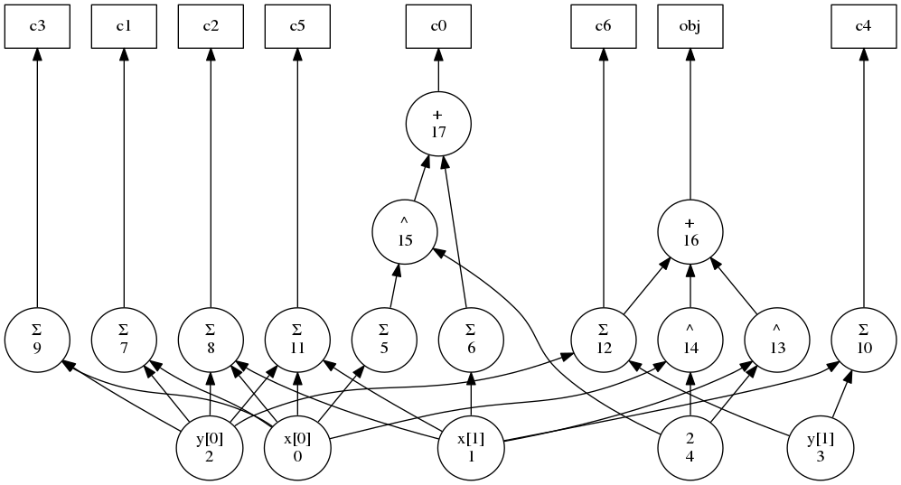

# `dot` command

GALINI provides a command to output a problem DAG to [Graphviz](https://www.graphviz.org/) DOT files.
This is useful when debugging code that needs to traverse the DAG.

## Usage

```
galini dot [-h] problem [out]
```

## Example

Given the following input file `problem.py`

```python
import pyomo.environ as aml

def get_pyomo_model():
    m = aml.ConcreteModel()
    m.x = aml.Var(range(2), bounds=(0, 4.0))
    m.y = aml.Var(range(2), bounds=(0, 1), domain=aml.Integers)

    m.obj = aml.Objective(expr=m.y[0] + m.y[1] + m.x[0]**2 + m.x[1]**2)
    m.c0 = aml.Constraint(expr=(m.x[0] - 2)**2 - m.x[1] <= 0)
    m.c1 = aml.Constraint(expr=m.x[0] - 2*m.y[0] >= 0)
    m.c2 = aml.Constraint(expr=m.x[0] - m.x[1] - 3*(1 - m.y[0]) <= 0)
    m.c3 = aml.Constraint(expr=m.x[0] - (1 - m.y[0]) >= 0)
    m.c4 = aml.Constraint(expr=m.x[1] - m.y[1] >= 0)
    m.c5 = aml.Constraint(expr=m.x[0] + m.x[1] >= 3*m.y[0])
    m.c6 = aml.Constraint(expr=m.y[0] + m.y[1] >= 1)
```

we run `galini dot` to obtain a `.dot` file

```
galini dot problem.py problem.dot
```

and we compile it to visualize the DAG

```
dot -T png -o problem.png problem.dot
```

