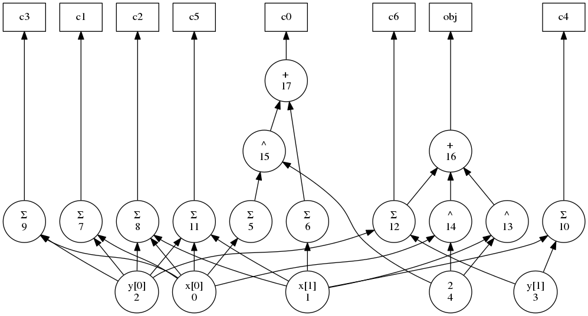

``dot`` Command
===============

GALINI provides a command to output a problem DAG to
`Graphviz <https://www.graphviz.org/>`_ DOT files.
This is useful when debugging code that needs to traverse the DAG.

Usage
-----

::

    galini dot [-h] problem [out]

Example
-------

Given the following input file ``problem.py``

.. code-block:: python

    import pyomo.environ as aml

    def get_pyomo_model():
        m = aml.ConcreteModel()
        m.x = aml.Var(range(2), bounds=(0, 4.0))
        m.y = aml.Var(range(2), bounds=(0, 1), domain=aml.Integers)

        m.obj = aml.Objective(expr=m.y[0] + m.y[1] + m.x[0]**2 + m.x[1]**2)
        m.c0 = aml.Constraint(expr=(m.x[0] - 2)**2 - m.x[1] <= 0)
        m.c1 = aml.Constraint(expr=m.x[0] - 2*m.y[0] >= 0)
        m.c2 = aml.Constraint(expr=m.x[0] - m.x[1] - 3*(1 - m.y[0]) <= 0)
        m.c3 = aml.Constraint(expr=m.x[0] - (1 - m.y[0]) >= 0)
        m.c4 = aml.Constraint(expr=m.x[1] - m.y[1] >= 0)
        m.c5 = aml.Constraint(expr=m.x[0] + m.x[1] >= 3*m.y[0])
        m.c6 = aml.Constraint(expr=m.y[0] + m.y[1] >= 1)

we run ``galini dot`` to obtain a ``.dot`` file

::

    galini dot problem.py problem.dot

and we compile it to visualize the DAG

::

    dot -T png -o problem.png problem.dot

   Problem DAG generated by GALINI and Graphviz
